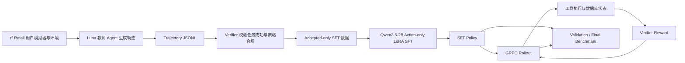

# Retail Agent：电商客服大模型 SFT + GRPO 流水线

本项目面向 τ²-bench Retail 电商客服场景，构建了一套从教师轨迹采集、数据清洗、SFT、在线 GRPO 到自动评测的后训练流水线。

项目重点是让 Agent 在τ²-bench Retail中模拟真实的用户对话、使用模拟tool和数据库环境完成任务，并满足认证、确认、工具调用顺序和最终状态等业务约束。

## Benchmark 定位与训练环境

τ²-bench 是一个**面向电商客服 Agent 的标准化、可交互、可验证的模拟业务环境**。

它自定义了：

- 电商任务；
- 用户身份和场景；
- 商品、订单、支付方式等模拟数据；
- 初始数据库状态；
- Agent 可以调用的工具；
- 用户模拟器；
- 标准终局状态和评测规则。

Agent 不是只生成一句回答，而是要在环境中完成完整轨迹：

```text
用户请求
→ 身份认证
→ 查询订单/商品
→ 生成操作方案
→ 请求用户确认
→ 调用修改/退款工具
→ 数据库状态改变
→ 给用户最终回复
```

本项目使用 τ²-bench 提供的标准化模拟环境作为电商 Agent 的训练和评测环境，**不直接连接真实电商生产数据库**。模拟数据库、商品数据和工具构成了可控的业务世界：模型必须通过工具读取或修改状态，评测器再根据最终状态和完整交互轨迹判断任务是否完成。

训练和评测严格区分 task：

- **train task**：用于教师轨迹采集、SFT 和 GRPO；
- **validation task**：用于比较 Raw/SFT 并选择 SFT checkpoint；
- **final-test task**：只用于最终评测，不能参与教师数据采集、SFT 或 GRPO 训练。

## 项目简介

- **业务场景**：Retail 电商客服，包括订单查询、取消、退款、退货、换货和订单修改。
- **环境**：τ²-bench Retail，使用 User Simulator 模拟用户，使用真实工具和数据库执行操作。
- **教师模型**：GPT5.6-Luna，通过 OpenAI-compatible API 生成高质量教师轨迹。
- **学生模型**：Qwen3.5-2B。
- **训练方式**：Action-only LoRA SFT + 在线 GRPO。
- **评测方式**：固定 task、固定 seed、多次 rollout，分别统计官方 τ² reward 和项目 Verifier reward。

## 整体流程



## 数据处理

教师轨迹记录以下事件：

```text
user_message
assistant_message
tool_call
tool_result
terminal_state
evaluation
```

Verifier 只允许任务成功、reward 有效且没有策略违规的轨迹进入 SFT 数据。SFT 数据采用 Action-only 训练：

- user 消息和 tool result 只作为上下文；
- assistant 文本回复和 tool call 才是训练目标；
- User Simulator 最后的 `###STOP###` 不作为 Agent 的训练目标；
- Qwen 的 `<|im_end|>` 由 chat template 作为 EOS 结束；
- assistant label 精确覆盖当前 assistant span，不包含后续 user/tool 内容。

当前推荐的 SFT 数据文件是：

```text
outputs/sft/accepted-qwen-clean.jsonl
```

## SFT 训练

```bash
python -u -m agent_for_business.cli train-sft \
  --model Qwen/Qwen3.5-2B \
  --dataset outputs/sft/accepted-qwen-clean.jsonl \
  --output-dir outputs/sft/checkpoint-qwen-fixed \
  --epochs 2 \
  --max-length 8192
```

SFT 输出是 PEFT LoRA adapter，不是完整模型。加载时需要配合原始基座模型 `Qwen/Qwen3.5-2B`。

## GRPO 训练

### SFT + GRPO

```bash
bash scripts/GRPO_train.sh
```

运行前请将脚本中的 `MODEL` 改为重新训练后的 SFT LoRA checkpoint，例如
`outputs/sft/checkpoint-qwen-fixed`。该脚本从 SFT LoRA checkpoint 开始训练，并将结果写入：

```text
outputs/grpo/checkpoint-<step>/
```

### Base + LoRA GRPO 对照实验

根目录的 `GRPO_train.sh` 默认配置为：

```bash
MODEL="Qwen/Qwen3.5-2B"
OUTPUT_DIR="outputs/grpo-base-lora"
```

这表示从原始 Qwen 基座创建一份新的 LoRA，不包含 SFT 权重。当前目录中的实际产物为：

```text
outputs/grpo-base-lora/checkpoint-1/
```

该 checkpoint 已保存 LoRA adapter、optimizer state、tokenizer 和 `grpo_manifest.json`，但只完成了 1 个 optimizer step，适合做加载和行为检查，不代表最终 GRPO 实验结果。

## Reward 定义

项目中需要区分官方 τ² reward 和项目 Verifier reward。

### 官方 τ² reward

每个 task 在 `reward_basis` 中定义自己的 reward 组件，最终 reward 是被选中组件的乘积。当前 Retail task 主要使用：

```text
τ² reward = DB reward × NL assertion reward
```

其中：

- `DB reward = 1`：最终 Agent/User 数据库状态和标准终局一致，否则为 `0`；
- `NL assertion reward = 1`：所有任务要求的自然语言断言都满足，否则为 `0`。

因此 τ² reward 通常是 `0.0` 或 `1.0`。`tau_reward >= 1.0` 被计为一次 task success。

### 项目 Verifier reward

项目 Verifier 会回放整条轨迹，额外检查：

- 身份认证是否完成；
- mutation 前是否给出操作摘要；
- 是否取得用户明确确认；
- 工具调用参数和调用顺序；
- 是否发生重复或不允许的并行调用；
- 工具错误数量。

当前 reward 规则为：

```text
如果策略违规：
    verifier_reward = -1.0

否则：
    verifier_reward = tau_reward
                       - min(0.2, 0.1 × tool_error_count)
```

例如：

| 场景 | τ² reward | Verifier reward |
| --- | ---: | ---: |
| 任务完成且合规 | 1.0 | 1.0 |
| 任务失败但没有策略违规 | 0.0 | 0.0 |
| 任务完成但出现 1 次可恢复工具错误 | 1.0 | 0.9 |
| 未确认就执行退款/修改 | 1.0 或 0.0 | -1.0 |
| 基础设施或 reward 无效 | invalid | 不参与训练统计 |

GRPO 使用 `verifier_reward`，在同一个 prompt group 内计算相对 advantage：

```text
advantage_i = (reward_i - group_mean) / (group_std + epsilon)
```

如果一个 group 的有效 rollout reward 完全相同，例如 `[0, 0, 0, 0]`，说明没有相对偏好信号，trainer 会跳过该 group，不执行空的 optimizer update。

## Benchmark 定义

Benchmark 不把所有内容压缩成一个分数，而是同时报告效果和可靠性。

主要指标包括：

- `tau_reward_mean`：官方 τ² reward 平均值；
- `tau_success_rate`：官方任务成功率；
- `verifier_reward_mean`：项目 Verifier reward 平均值；
- `policy_violation_rate`：策略违规比例；
- `tool_error_rate`：发生工具错误的运行比例；
- `db_match_rate`：最终数据库状态匹配比例；
- `communication_rate`：必要信息沟通完整比例；
- `incomplete_runs`：未完成的运行数量；
- `termination_counts`：运行结束原因统计。

评测协议：

- validation：固定 14 个 task，用于 Raw/SFT checkpoint 选择；
- final test：固定 30 个 task，每题 3 次 trial，共 90 次运行；
- Raw、SFT 和 GRPO 使用相同的 task/seed 协议进行比较；
- final test 不参与 SFT 或 GRPO checkpoint 选择。

## 实验结果

当前仓库已保存的 GRPO 产物是 `outputs/grpo-base-lora/checkpoint-1`，只完成了 1 个 optimizer step；训练日志中 User Simulator 曾出现网关限流，因此当前没有完整的 GRPO final benchmark 结果。

Base/SFT 的正式数值应从完整的 benchmark JSON 中填写。不要把未完成运行的平均值当作最终结果。

### 结果表模板

| Model | Verifier Reward | Task Success Rate |
| --- | ---: | ---: |
| Qwen3.5-2B Base | 待填实测结果 | 待填实测结果 |
| Qwen3.5-2B SFT | 待填实测结果 | 待填实测结果 |
| Qwen3.5-2B SFT + GRPO | 待填实测结果 | 待填实测结果 |

### 示例结果（仅用于展示 README 格式，非当前实测结果）

如果需要展示完整报告的排版，可以使用下面的示例格式。带 `*` 的数字必须在真实跑完 `90` 次 final benchmark 后替换，不能直接写进简历：

| Model | Verifier Reward | Task Success Rate |
| --- | ---: | ---: |
| Qwen3.5-2B Base | 0.42* | 36.7%* |
| Qwen3.5-2B SFT | 0.68* | 60.0%* |
| Qwen3.5-2B SFT + GRPO | 0.76* | 70.0%* |

## vLLM 评测流程

LoRA checkpoint 不能直接作为 vLLM 的 `--model`。必须使用基座模型，并通过 `--lora-modules` 挂载 adapter：

```bash
python -u scripts/serve_qwen.py \
  --model Qwen/Qwen3.5-2B \
  --served-model-name qwen-grpo \
  --host 0.0.0.0 \
  --port 8000 \
  --api-key EMPTY \
  --max-model-len 32768 \
  --max-num-seqs 4 \
  --gpu-memory-utilization 0.7 \
  --enable-auto-tool-choice \
  --tool-call-parser qwen3_coder \
  --enable-lora \
  --lora-modules qwen-grpo=outputs/grpo-base-lora/checkpoint-1
```

检查服务：

```bash
curl -H "Authorization: Bearer EMPTY" \
  http://127.0.0.1:8000/v1/models
```

然后运行 benchmark：

```bash
python -u scripts/run_final_benchmark.py \
  --env-file .env \
  --agent-llm openai/qwen-grpo \
  --vllm-api-base http://127.0.0.1:8000/v1 \
  --vllm-api-key EMPTY \
  --output outputs/benchmarks/qwen-grpo-final.json \
  --summary-output outputs/benchmarks/qwen-grpo-final.md \
  --num-trials 3 \
  --seed 300 \
  --max-concurrency 1
```

`vLLM` 的作用是把本地 Base + LoRA 模型暴露为 OpenAI-compatible API；当前 benchmark 通过 URL、API key 和 model name 访问 Agent。User Simulator 的模型和 API 配置仍从 `.env` 读取。

长时间运行时使用 `screen`：

```bash
screen -S vllm-grpo
conda activate agent-for-business
cd ~/autodl-tmp
python -u scripts/serve_qwen.py ... 2>&1 | tee vllm-grpo.log
```

按 `Ctrl+A`、`D` 离开，之后用下面的命令恢复：

```bash
screen -r vllm-grpo
```

## 项目亮点

- 设计统一 trajectory contract，记录用户、Agent、工具和终局状态；
- 使用 Luna 生成教师轨迹，并通过 Verifier 过滤成功且合规的数据；
- 实现 Action-only SFT，避免训练 user/tool observation；
- 修复 Qwen chat template 下 assistant label 跨消息错位问题；
- 实现 Qwen3.5 XML tool-call parser 和 token-level rollout trace；
- 实现在线 GRPO、group advantage、action-only clipped objective 和 reference KL；
- 对认证、显式确认、工具顺序和策略违规进行确定性校验；
- 使用固定 task、seed 和 trial 进行可复现 benchmark。

## 简历写法

### 中文项目描述

**Retail 电商客服大模型 SFT + GRPO 后训练系统**

- 基于 τ²-bench Retail 搭建电商客服 Agent 后训练流水线，使用 Luna 教师模型模拟多轮用户交互，并通过工具和数据库执行订单查询、取消、退货、退款和换货任务。
- 设计统一 trajectory 数据协议和业务轨迹 Verifier，联合校验任务终局状态、身份认证、用户确认、工具调用顺序及策略违规，将成功且合规的轨迹筛选为 Action-only SFT 数据。
- 基于 Qwen3.5-2B 实现 LoRA SFT 和在线 GRPO，完成 group advantage、action-token clipped objective、reference KL、rollout trace 和 checkpoint/resume。
- 构建 Raw/SFT/GRPO benchmark，统计 task success rate、Verifier reward、数据库状态匹配率、策略违规率、工具错误率和对话终止原因，支持固定 task/seed 的可复现实验对比。

### 面试口述版

> 我做的是一个电商客服 Agent 的后训练系统。先用 τ²-bench 和 Luna 模拟真实用户及工具环境，采集多轮交互轨迹；然后通过业务 Verifier 检查数据库最终状态、认证、确认语义和工具调用顺序，只保留成功且合规的轨迹进行 Action-only SFT。SFT 后再使用在线 GRPO，让模型根据实际业务结果优化策略。评测时不只看文本，而是同时统计任务成功率、Verifier reward、数据库状态、策略违规和工具错误。

## 目录结构

```text
src/agent_for_business/
├── trajectory.py             # 统一轨迹协议
├── trajectory_store.py       # JSONL 持久化
├── tau_adapter.py            # τ² SimulationRun 适配
├── policy_verifier.py        # 业务规则和 reward 校验
├── sft_dataset.py            # SFT 数据构建和 Action-only labels
├── sft_training.py           # LoRA SFT 训练入口
├── grpo_agent.py             # 本地 Qwen Agent 和工具调用解析
├── grpo_rollout.py           # τ² 本地 policy rollout
├── grpo_objective.py         # GRPO 可微目标
├── grpo_online.py            # 在线 GRPO trainer
└── validation_benchmark.py   # Raw/SFT validation

scripts/
├── serve_qwen.py             # vLLM 服务启动
├── run_final_benchmark.py    # final benchmark
├── sft_train.sh              # SFT 启动脚本
└── GRPO_train.sh             # SFT-based GRPO 启动脚本
```

## 环境和测试

真实 τ²、Transformers、PEFT 和 GPU 训练建议使用 AutoDL Python 3.12 环境：

```bash
uv sync --extra dev --extra training
uv run pytest -q
```

训练和评测产生的 API key 不应写入 JSON manifest 或提交到 Git；如果已经落盘，应立即撤销并重新生成。
